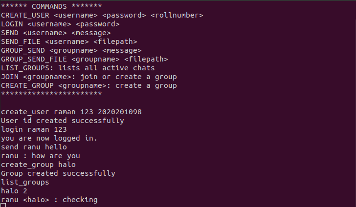
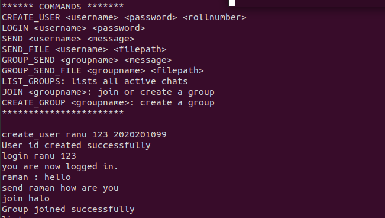
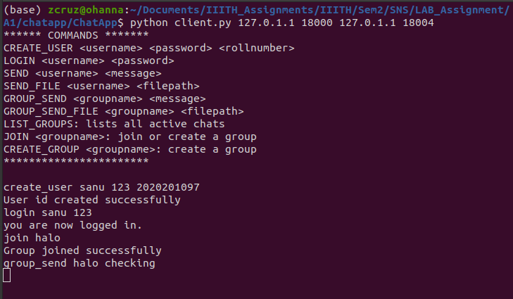

# SNS ASSIGNMENT 1
## A terminal based chatting application with end to end encryption, multiple group functionality and file sharing.

## Running Instructions:
* For Server : python3 server.py < -- /PORT NO.>
* For Client : python3 client.py <-SERVER IP-> <-SERVER PORT-> <-IP-> <-PORT NO.->
* The later two ip port are of the server which will be running inside the client since client is p2p.

## COMMANDS
* create_user   <-username->   <-password->  <-rollnumber-> ----> Creates a new user
* login <-username-> <-password-> -----> Logs in a user
* send <-username-> <-message->   -----> sends message to the specified user
* send_file <-username-> <-filepath->   -----> sends file to the specified user
* create_group <-groupname->                -----> creates group with the specified name
* join <-groupname->   ----->the user joins the specified group
* list_groups  ----->lists the name and the members of the groups
* group_send <-groupname-> <-message->    ------>sends a message to the specified group
* group_send_file <-groupname-> <-filepath->----->sends a file to the specified group

## OUTPUT SCREENSHOTS:
* 
* 
* 
